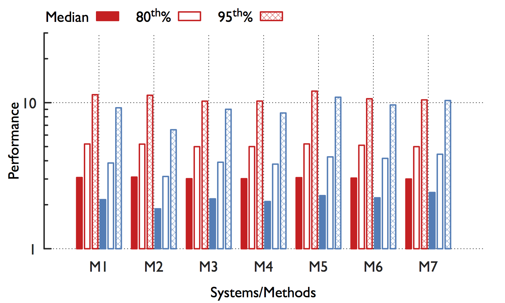
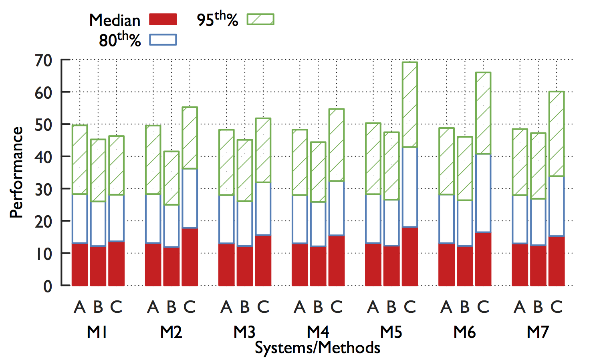

# About

Collection of [Gnuplot][3] scripts inspired by by Brighten's [blog post][1]. Most of the plots will work on `gnuplot 4.6.5` or above, but a few that use `dashtype` need `gnuplot 5.x`.

## Colorbrewer
Some of the plots scripts use the excellent [gnuplot-colorbrewer][2]. To make such plots work, clone the [gnuplot-colorbrewer][2] package, and add the following lines to the '~/.gnuplot' file.
```
set loadpath                                      \
    '~/<path-to-gnuplot-colorbrewer>/diverging'   \
    '~/<path-to-gnuplot-colorbrewer>/qualitative' \
    '~/<path-to-gnuplot-colorbrewer>/sequential'
```

---

**Side-by-side Histograms**

_Colors represent different systems, and the patterns represent the different statistics._

Source: `multi-cmp-hist`

---

**Stacked Histograms**

_Colors and patterns represent the different statistics. Labels along the X-axis indicate the methods and systems._

Source: `stacked-hist`

---

**Simple Histograms with Error bars**


Source: `simple-hist`


[1]: http://youinfinitesnake.blogspot.com/2011/02/attractive-scientific-plots-with.html "Attractive scientific plots with gnuplot"
[2]: https://github.com/aschn/gnuplot-colorbrewer.git "aschn/gnuplot-colorbrewer"
[3]: http://gnuplot.sourceforge.net "Gnuplot homepage"
