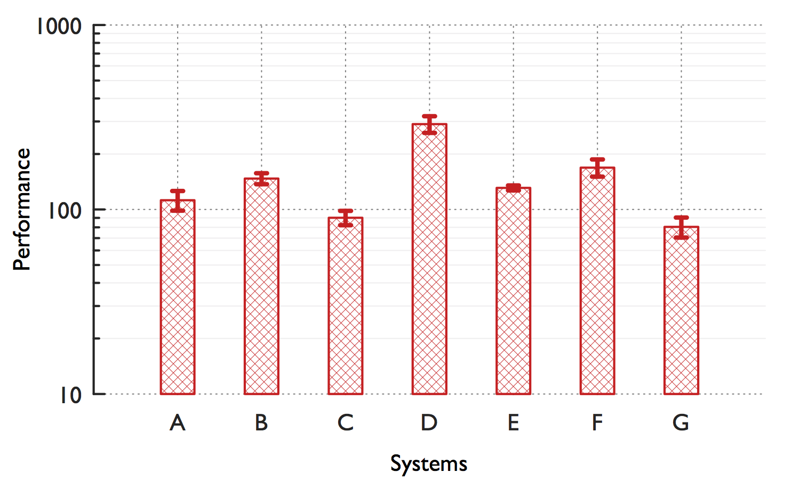

# About

Collection of Gnuplot scripts inspired by by Brighten's [blog post][1].

**Side-by-side Histograms**

_Colors represent different systems, and the patterns represent the different statistics._

Source: `multi-cmp-hist`

---

**Stacked Histograms**

_Colors and patterns represent the different statistics. Labels along the X-axis indicate the methods and systems._

Source: `stacked-hist`

---

**Simple Histograms with Error bars**

Source: `simple-hist`

[1]: http://youinfinitesnake.blogspot.com/2011/02/attractive-scientific-plots-with.html "Attractive scientific plots with gnuplot"
